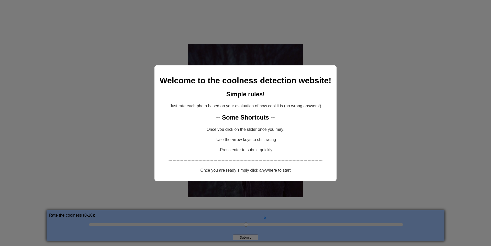
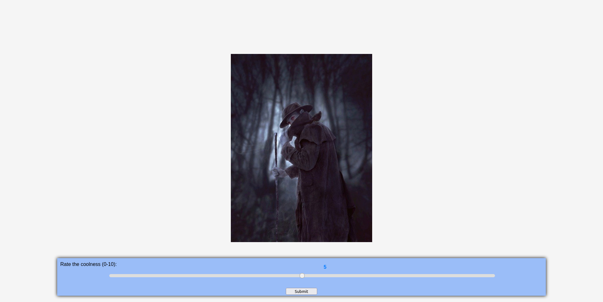

# coolness_factor
### Project README

#### Project Data Structure

This project implements a simple machine learning pipeline for analyzing image data. The main components of the project include:

1. **preprocess_data.py**: This module contains functions for preprocessing image data. It includes functions for extracting color histograms, texture features using Gray-Level Co-occurrence Matrices (GLCM), and shape-based features such as contour area and perimeter.

2. **train_model.py**: This script trains a machine learning model using the preprocessed image data. It uses features extracted from images to predict a "coolness" score. The model architecture includes a simple neural network and optionally a Gradient Boosting Regressor.

3. **test_model.py**: This script tests the trained model on new images. It preprocesses new images and uses the trained model to predict the coolness score of each image.

4. **test_against_data.py**: This script compares the predictions made by the trained model against user ratings stored in a database. It preprocesses images, predicts coolness scores, and compares them with user ratings to evaluate model performance.

5. **retrieve_data.py**: This module provides functions to retrieve data from a SQLite database. It connects to the database, executes SQL queries to retrieve data, and returns the results.

#### Explanation of the Data Structure

The data structure of this project involves a pipeline for processing and analyzing image data. It consists of the following steps:

1. **Data Retrieval**: Image data and corresponding user ratings are retrieved from a SQLite database using SQL queries.

2. **Data Preprocessing**: Image data is preprocessed using techniques such as resizing, histogram computation, texture feature extraction, and shape-based feature extraction.

3. **Model Training**: A machine learning model is trained using the preprocessed image data. The model learns to predict a "coolness" score based on extracted features.

4. **Model Testing**: The trained model is tested on new images to predict their coolness scores. These predictions are compared against user ratings to evaluate model performance.

#### Running the Project

To run the project, follow these steps:

1. Ensure you have Python installed on your system (version 3.6 or higher recommended).

2. Install the required dependencies by running the following command in your terminal:

   ```bash
   pip install -r requirements.txt
   ```

3. Prepare your image data and store user ratings in a SQLite database.

4. Modify the database path and SQL queries in `retrieve_data.py` to match your database setup.

5. Run the scripts in the following order:

   - `train_model.py`: Train the machine learning model using preprocessed image data.
   - `test_model.py`: Test the trained model on new images to predict their coolness scores.
   - `test_against_data.py`: Compare model predictions against user ratings stored in the database to evaluate model performance.

6. Follow the instructions provided by each script to input necessary parameters or paths.

Note: Make sure your image data is organized and named correctly according to the expected file paths in the scripts.

#### Data Collection

The data for this project was collected using a website I created using flask which was run locally on my mac. The website was hosted on coolness-factor.duckdns.org and was spread through my other class's Piazza as well as reddit and friends and family. The website randomly cycled through the 593 different images located in the /app/static/images folder that I obtained online. With each image, the user was presented with a slider upon which they could rate the "coolness" of each image on a scale from 0-10. Looking through the database, I only received ~900 ratings throughout the past couple weeks. This means that some images weren't rated, and most were only rated once. This affects my model, as it does not have a lot to learn from. The impact can be seen in the model following closely to ratings that were given by the user, although there are some exceptions in which you can see that the model had deviations from. It was interesting to compare the model's rating of the same photos shown to the user, and in the **test_against_data.py** I played with this. The output of the lowest rated and highest rated photos are sent to the standard output meaning you can see which images these are and check in the folder to see if you agree with the ratings. I found that the "coolest" images I was in agreement with, although the "uncoolest" were a bit controversial in my mind. I also have a plot showing the difference in the user's rating and the model's rating. The large spikes are most likely due to the fact that the user did not rate every photo, therefore there are some outliers that we can see where the model has a "completely different" opinion than the user. This is due to the low sample size and can be explained by a lack of user ratings for every photo.

Here are a couple pictures showing the website in case I take it down by the time you are grading this project:



